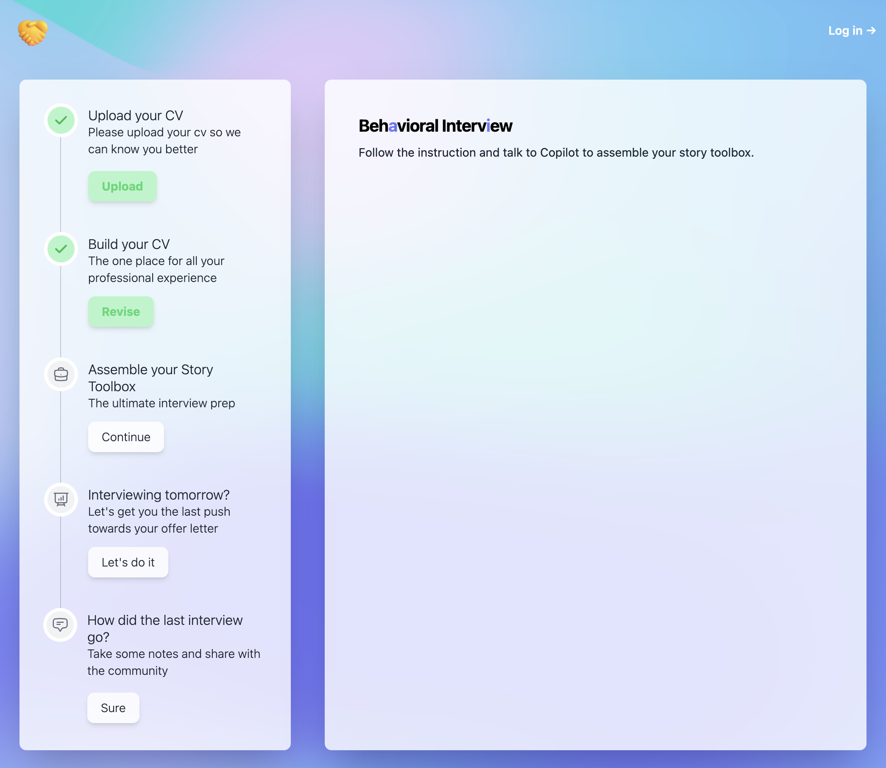
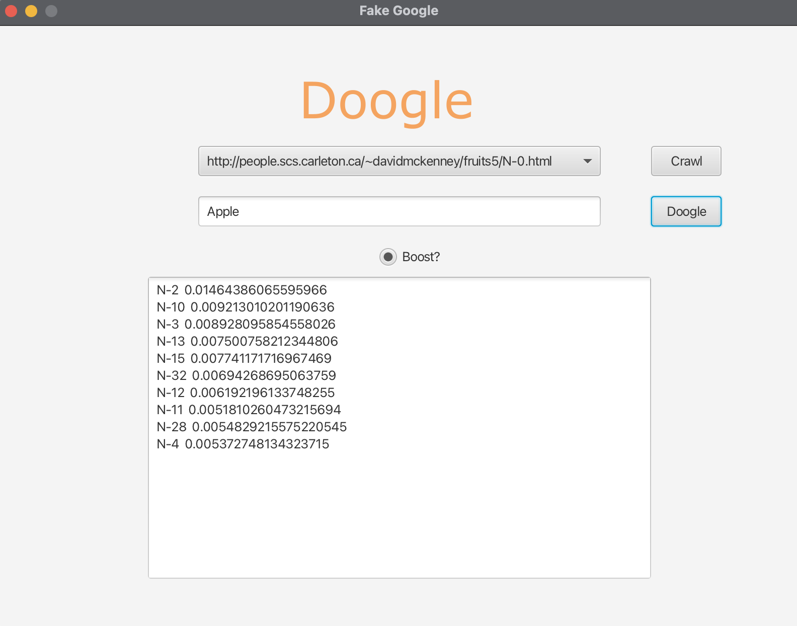

# 🔨 My Projects

### Behavioral-Interview.ai
- **Link:** [GitHub Repository](https://github.com/ariazmzhang/behavioralinterview.ai)
- **Tech Stack:** Next.js, Typescript, Tailwindcss, Firebase
- **Descriptions:**
  - **Story Creation and Management:** Users can create and manage their personal repository of stories, showcasing their achievements, problem-solving abilities, teamwork skills, and more.
  - **AI-Driven Story Analysis:** The application employs the ChatGPT API to analyze the effectiveness and coherence of users' stories. It provides valuable insights and suggestions to enhance the storytelling technique, ensuring that interview responses are persuasive and engaging.
  - **Interview Scenario Simulations:** The project offers a range of interview scenario simulations, allowing users to practice their storytelling skills in realistic interview settings. The AI-powered system provides real-time feedback, helping users refine their delivery and adapt their stories to various behavioral questions.
  - **Integration with Firebase:** The Firebase backend provides secure user authentication, data storage, and real-time synchronization of story updates across devices. This ensures a seamless and reliable experience for users, allowing them to access their stories from anywhere.
- 

### Search Engine 1.0 & 2.0
- **Link:** [GitHub Repository](https://github.com/ariazmzhang/java-based-search-engine)
- **Tech Stack:** Python, Java, NumPy, urllib, JavaFX
- **Descriptions:**
  - Developed Search Engine 1.0 in Python, efficiently crawling over 1,000 interlinked websites.
  - Leveraged cosine similarity scoring calculation between user search query and crawled pages content to determine the content score of each web page.
  - Employed PageRank algorithm to rank crawled web pages, boosting search results by only showing top-quality content.
  - Refined the architecture using OOP principles for Search Engine 2.0 in Java, bolstering modularity and extensibility.
  - Augmented the user experience by crafting an intuitive graphical user interface (GUI) with JavaFX.
- 

### Feedback-Collection
- **Link:** [GitHub Repository](https://github.com/ariazmzhang/feedback-collection)
- **Tech Stack:** React, Node.js, Express, MongoDB
- **Descriptions:**
  - Created a web application for startup owners to send bulk feedback request emails to customers and obtain tabulated results.
  - Implemented Google OAuth API using Passport.js middleware to ensure secure access to the application.
  - Utilized MongoDB/Mongoose for storing client information and manage credit cards payments using Stripe API.
- 

### [Ghost Hunting Game](https://github.com/ariazmzhang/Ghost-Hunting-Game)

- **Tech Stack:** C, Linux, semaphore.h, pthread.h, Valgrind, Makefile
- **Descriptions:**
  - Developed a multi-threaded ghost hunting simulation in C, offering players a dynamic gameplay experience on Linux platforms.
  - Incorporated semaphores to ensure thread-safety, facilitating smooth concurrent operations without race conditions.
  - Employed Valgrind for memory management, ensuring efficient resource allocation and preventing potential memory leaks.

